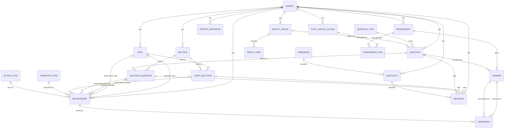

# Elicit Survey — Entity Model

> Reverse-engineered from `src/main/java/com/elicitsoftware/model/*.java` (JPA/Panache
> entities) and the Flyway migrations under `src/main/resources/db/migration/` (V001–V004,
> V006–V009; there is no V005). Two database schemas exist: **survey** (the operational,
> JPA-mapped schema this application reads/writes directly) and **surveyreport** (a
> Kimball-style star-schema fed by ETL, accessed only via native SQL — no JPA entities exist
> for it, so it is documented here straight from the SQL DDL). `survey.dimensions`,
> `survey.ontology`, and `survey.metadata` are a generic tagging/extension mechanism in the
> **survey** schema that also has no JPA entity — included for the same reason.

## Diagram

*(The `surveyreport` star schema — `DIM_DATE`, `DIM_STEP`, `DIM_SECTION`, `DIM_STATUS`,
`FACT_SECTIONS`, `FACT_RESPONDENTS` — is described in its own subsection below and omitted
from the diagram above to keep the operational-schema relationships legible; see
"surveyreport Schema (ETL Star Schema)".)*

---

## survey Schema — Core Entities

### SURVEY

A single configured questionnaire definition — the root of a decision-tree survey, with its steps, sections, questions, branching rules, reports, and post-survey actions all scoped to it.

| Attribute | Description | Data Type | Length/Precision | Validation Rules |
|---|---|---|---|---|
| id | Primary key. | Long | — | Primary Key, Sequence |
| name | Internal/unique name for the survey. | String | 255 | Not Null, Unique |
| displayOrder | Order surveys are listed in (e.g., on the login survey picker). | Integer | 3 | Not Null, Unique |
| title | Respondent-facing title. | String | 255 | Not Null |
| description | Longer descriptive text. | String | 2000 | Optional |
| initialDisplayKey | The display key of the first step/section shown to a new respondent. | String | 255 | Optional |
| postSurveyURL | URL the respondent is redirected to after viewing reports, if configured. | String | 255 | Optional |

### RESPONDENT

A single person's attempt at taking a survey, identified by their login token; tracks login activity and completion state.

| Attribute | Description | Data Type | Length/Precision | Validation Rules |
|---|---|---|---|---|
| id | Primary key. | Long | — | Primary Key, Sequence |
| surveyId | The survey this respondent is taking. | Long | — | Not Null, Foreign Key (SURVEY.id) |
| token | The login token issued to this respondent. | String | 255 | Not Null |
| active | Whether the respondent is still taking the survey (true) or has finalized/is inactive (false). | Boolean | — | Not Null, Default: true |
| logins | Number of times this respondent has logged in. | Integer | — | Not Null, Default: 0 |
| createdDt | When the respondent record was created. | DateTime | — | Not Null |
| firstAccessDt | When the respondent first logged in. | DateTime | — | Optional |
| finalizedDt | When the respondent finalized the survey. | DateTime | — | Optional |

*Uniqueness note (from SQL, not enforced at the Java level as a bean-validation rule): `(survey_id, token)` is unique.*

### STEP

The largest organizational unit within a survey — a named, ordered group of one or more sections that may repeat as a unit (e.g., "Family Member" repeated per relative).

| Attribute | Description | Data Type | Length/Precision | Validation Rules |
|---|---|---|---|---|
| id | Primary key. | Long | — | Primary Key, Sequence |
| surveyId | The survey this step belongs to. | Long | — | Not Null, Foreign Key (SURVEY.id) |
| displayOrder | Order steps are shown in within the survey. | Integer | 3 | Not Null |
| name | Internal name of the step. | String | 255 | Optional |
| description | Respondent-facing description/title of the step. | String | 255 | Optional |

### SECTION

A named, ordered group of questions shown together on one screen; sections are attached to one or more steps via STEPS_SECTIONS and may themselves repeat.

| Attribute | Description | Data Type | Length/Precision | Validation Rules |
|---|---|---|---|---|
| id | Primary key. | Long | — | Primary Key, Sequence |
| surveyId | The survey this section belongs to. | Long | — | Not Null, Foreign Key (SURVEY.id) |
| displayOrder | Order sections are shown in. | Integer | 3 | Not Null |
| name | Internal name of the section. | String | 255 | Optional |
| description | Respondent-facing description/title of the section. | String | 255 | Optional |

### STEPS_SECTIONS

The junction between a step and a section, capturing the ordering of each within the other and the pre-computed display key prefix used to address that step/section combination for a given respondent.

| Attribute | Description | Data Type | Length/Precision | Validation Rules |
|---|---|---|---|---|
| id | Primary key. | Long | — | Primary Key, Sequence |
| surveyId | The survey this mapping belongs to. | Long | — | Not Null |
| stepId | The step in this mapping. | Long | — | Not Null, Foreign Key (STEP.id) |
| stepDisplayOrder | The step's display order at the time of mapping. | Integer | — | Optional |
| sectionId | The section in this mapping. | Long | — | Not Null, Foreign Key (SECTION.id) |
| sectionDisplayOrder | The section's display order within the step. | Integer | — | Optional |
| displaykey | The step/section-level display key prefix (`survey-step-stepInstance-section-...`). | String | 34 | Not Null |

### QUESTION

A single question definition — its prompt text, input type, and validation constraints — reusable across any section that places it via SECTIONS_QUESTION.

| Attribute | Description | Data Type | Length/Precision | Validation Rules |
|---|---|---|---|---|
| id | Primary key. | Long | — | Primary Key, Sequence |
| surveyId | The survey this question belongs to. | Long | — | Not Null, Foreign Key (SURVEY.id) |
| required | Whether an answer must be provided. | Boolean | — | Not Null, Default: false |
| minValue | Minimum allowed numeric value, if applicable. | Integer | 10 | Optional |
| maxValue | Maximum allowed numeric value, if applicable. | Integer | 10 | Optional |
| text | The full question prompt shown to the respondent. | String | 8000 | Not Null |
| shortText | An abbreviated label (e.g., used in Review summaries). | String | 100 | Optional |
| toolTip | Optional helper text shown alongside the question. | String | 255 | Optional |
| mask | Optional input mask pattern. | String | 255 | Optional |
| placeholder | Optional placeholder text for the input control. | String | 255 | Optional |
| validationText | Message shown when validation fails. | String | 255 | Optional |
| defaultValue | Value pre-filled when the question is first shown. | String | 255 | Optional |
| questionTypeId | The input type this question renders as. | Long | — | Not Null, Foreign Key (QUESTION_TYPE.id) |
| selectGroupId | The set of selectable options, for select-style question types. | Long | — | Optional, Foreign Key (SELECT_GROUP.id) |
| variant | Optional rendering variant hint. | String | 255 | Optional |

### QUESTION_TYPE

The vocabulary of input widgets a question can render as (e.g., TEXT, RADIO, CHECKBOX, DATE_PICKER, HTML, MODAL — see `GlobalStrings` for the exact set the UI knows how to render).

| Attribute | Description | Data Type | Length/Precision | Validation Rules |
|---|---|---|---|---|
| id | Primary key. | Long | — | Primary Key, Sequence |
| name | The type identifier (e.g., "RADIO", "CHECKBOX_GROUP"). | String | 255 | Optional |
| dataType | The underlying data type the answer is stored/interpreted as. | String | 255 | Optional |
| description | Human-readable description of the type. | String | 255 | Optional |

### SECTIONS_QUESTION

Places a specific question into a specific section (within a survey) at a given display order; this is the entity that upstream/downstream branching rules (RELATIONSHIP) point to when referencing "a question in a section."

| Attribute | Description | Data Type | Length/Precision | Validation Rules |
|---|---|---|---|---|
| id | Primary key. | Long | — | Primary Key, Sequence |
| displayOrder | Order this question appears within its section. | Integer | 3 | Not Null |
| questionId | The question being placed. | Long | — | Not Null, Foreign Key (QUESTION.id) |
| sectionId | The section the question is placed into. | Long | — | Not Null, Foreign Key (SECTION.id) |
| surveyId | The survey this placement belongs to. | Long | — | Not Null, Foreign Key (SURVEY.id) |

### SELECT_GROUP

A named, reusable set of selectable options for RADIO/CHECKBOX_GROUP/COMBOBOX-style questions.

| Attribute | Description | Data Type | Length/Precision | Validation Rules |
|---|---|---|---|---|
| id | Primary key. | Long | — | Primary Key, Sequence |
| surveyId | The survey this group belongs to. | Long | — | Not Null, Foreign Key (SURVEY.id) |
| name | Internal name of the group. | String | 255 | Optional |
| description | Optional description. | String | 255 | Optional |

### SELECT_ITEM

One selectable option within a SELECT_GROUP, with the coded (stored) value and its displayed label.

| Attribute | Description | Data Type | Length/Precision | Validation Rules |
|---|---|---|---|---|
| id | Primary key. | Long | — | Primary Key, Sequence |
| surveyId | The survey this item belongs to. | Long | — | Not Null, Foreign Key (SURVEY.id) |
| selectGroupId | The group this item belongs to (mapped via `group_id`). | Long | — | Not Null, Foreign Key (SELECT_GROUP.id) |
| codedValue | The value stored on the answer when this item is selected. | String | 255 | Optional |
| displayText | The label shown to the respondent. | String | 255 | Optional |
| displayOrder | Order this item appears within its group. | Integer | 20 | Not Null |

### ANSWER

The respondent's recorded response to a single question instance — or, when it has no question, a synthetic marker answer representing a visited step or section, used to drive navigation and the display of section/step names. Central to the decision-tree traversal: every step, section, and question the respondent has been shown gets an Answer row, soft-deleted when branching removes it.

| Attribute | Description | Data Type | Length/Precision | Validation Rules |
|---|---|---|---|---|
| id | Primary key. | Long | — | Primary Key, Sequence |
| surveyId | The survey this answer belongs to. | Long | — | Not Null |
| respondentId | The respondent who gave this answer. | Long | — | Not Null, Foreign Key (RESPONDENT.id) |
| stepId | The step display order component of this answer's position. | Integer | 4 | Not Null |
| stepInstance | Which repeated instance of the step this answer belongs to. | Integer | 4 | Not Null |
| sectionId | The section display order component of this answer's position. | Integer | — | Optional (nullable in the database; the Java entity declares it Not Null — a documented Java/SQL mismatch) |
| sectionInstance | Which repeated instance of the section this answer belongs to. | Integer | 10 | Not Null |
| questionInstance | Which repeated instance of the question this answer belongs to. | Integer | 10 | Not Null |
| sectionQuestionId | The specific question placement this answer responds to; null for step/section marker answers. | Long | 20 | Optional, Foreign Key (SECTIONS_QUESTION.id) |
| questionId | The question this answer responds to; null for step/section marker answers. | Long | — | Optional, Foreign Key (QUESTION.id) |
| displayKey | The full 7-segment hierarchical address of this answer (`survey-step-stepInstance-section-sectionInstance-question-questionInstance`). | String | 34 | Not Null, Default: "0.0.0.0.0.0.0" |
| displayText | The rendered label/prompt shown for this answer (question text, or section/step name for marker answers). | String | 8000 | Not Null |
| textValue | The raw stored answer value (interpreted per question type — e.g., parsed as a date, number, or comma-joined list of selections). | String | 255 | Optional |
| deleted | Soft-delete flag; true when a branching change has removed this answer from the respondent's current path. | Boolean | — | Not Null, Default: false |
| createdDt | When the answer row was first created. | DateTime | — | Not Null |
| savedDt | When the answer's value was last saved by the respondent. | DateTime | — | Optional |

*Uniqueness note (from SQL): `(respondent_id, display_key)` is unique.*

### DEPENDENT

Records that a specific downstream ANSWER exists because a specific upstream ANSWER, evaluated by a specific RELATIONSHIP, produced it — the audit trail the branching engine uses to know what to remove if the upstream answer later changes.

| Attribute | Description | Data Type | Length/Precision | Validation Rules |
|---|---|---|---|---|
| id | Primary key. | Long | — | Primary Key, Sequence |
| respondentId | The respondent this dependency belongs to. | Integer | 20 | Not Null |
| upstreamId | The answer that triggered this dependency. | Long | — | Not Null, Foreign Key (ANSWER.id) |
| downstreamId | The answer that was produced/affected by this dependency. | Long | — | Not Null, Foreign Key (ANSWER.id) |
| relationshipId | The branching rule that produced this dependency. | Long | — | Not Null, Foreign Key (RELATIONSHIP.id) |
| deleted | Soft-delete flag; true once the dependency no longer holds. | Boolean | — | Not Null, Default: false |

### RELATIONSHIP

A single configured branching rule: "when the upstream question's answer satisfies this operator/reference-value condition, take this action (SHOW / REPEAT / TEXT) on this downstream question, section, or step." This is the decision-tree engine's rule table.

| Attribute | Description | Data Type | Length/Precision | Validation Rules |
|---|---|---|---|---|
| id | Primary key. | Long | 20 | Primary Key, Sequence |
| surveyId | The survey this rule belongs to. | Integer | — | Not Null |
| defaultUpstreamValue | Fallback value substituted for the upstream answer's actual value in token replacement, if configured. | String | 255 | Optional |
| description | Human-readable description of the rule. | String | 255 | Optional |
| referenceValue | The value the upstream answer is compared against by the configured operator. | String | 255 | Optional |
| token | The placeholder token (used in `{token|default}` text substitution) this rule's upstream value can be inserted as. | String | 10 | Optional |
| actionTypeId | The action to take when the rule is satisfied (SHOW / REPEAT / TEXT). | Long | — | Not Null, Foreign Key (ACTION_TYPE.id) |
| operatorTypeId | The comparison operator used to evaluate the upstream answer. | Long | — | Not Null, Foreign Key (OPERATOR_TYPE.id) |
| upstreamStepId | The step the upstream question must be within, if constrained. | Long | — | Optional, Foreign Key (STEP.id) |
| upstreamQuestionId | The question whose answer is evaluated. | Long | — | Not Null, Foreign Key (SECTIONS_QUESTION.id) |
| downstreamStepId | The step affected by this rule, if the action targets a step. | Long | — | Optional, Foreign Key (STEP.id) |
| downstreamSectionId | The step/section mapping affected by this rule, if the action targets a section (despite the name, this references STEPS_SECTIONS, not SECTION directly). | Long | — | Optional, Foreign Key (STEPS_SECTIONS.id) |
| downstreamQuestionId | The question affected by this rule, if the action targets a question. | Long | — | Optional, Foreign Key (SECTIONS_QUESTION.id) |

### OPERATOR_TYPE

The vocabulary of comparison operators a RELATIONSHIP can use to evaluate an upstream answer (e.g., BOOLEAN, EQUAL, NOT_EQUAL, FIELD_EXIST, CONTAINS; GREATER THAN is seeded — LESS THAN is not currently seeded in reference data).

| Attribute | Description | Data Type | Length/Precision | Validation Rules |
|---|---|---|---|---|
| id | Primary key. | Long | — | Primary Key, Sequence |
| name | The operator identifier (e.g., "EQUAL", "CONTAINS"). | String | 255 | Optional |
| description | Human-readable description. | String | 255 | Optional |
| symbol | A short symbolic representation, if any. | String | 10 | Optional |

### ACTION_TYPE

The vocabulary of actions a RELATIONSHIP can trigger when satisfied (SHOW, REPEAT, TEXT are actively used in the branching engine).

| Attribute | Description | Data Type | Length/Precision | Validation Rules |
|---|---|---|---|---|
| id | Primary key. | Long | — | Primary Key, Sequence |
| name | The action identifier (e.g., "SHOW", "REPEAT", "TEXT"). | String | 255 | Optional |
| description | Human-readable description. | String | 255 | Optional |

*Note: this table is fully defined and seeded but, per code inspection, no other action-type value beyond SHOW/REPEAT/TEXT is ever referenced by the branching engine.*

### REPORT_DEFINITION

A configured report the respondent sees after finalizing — an external service endpoint the survey calls with the respondent's id to obtain report content, shown in the reports view.

| Attribute | Description | Data Type | Length/Precision | Validation Rules |
|---|---|---|---|---|
| id | Primary key. | Long | — | Primary Key, Sequence |
| surveyId | The survey this report belongs to. | Long | — | Not Null, Foreign Key (SURVEY.id) |
| name | Internal name of the report. | String | 255 | Not Null |
| description | Description of the report's content. | String | 255 | Not Null |
| url | The external report service endpoint to call. | String | 255 | Optional |
| displayOrder | Order this report is shown in among the survey's reports. | Integer | — | Not Null |

*Uniqueness note (from SQL): `(survey_id, name)` is unique.*

### POST_SURVEY_ACTION

A configured webhook the system calls once the respondent finalizes — used to notify an external system (e.g., registration/EHR integration) that the respondent has completed the survey.

| Attribute | Description | Data Type | Length/Precision | Validation Rules |
|---|---|---|---|---|
| id | Primary key. | Long | — | Primary Key, Sequence |
| surveyId | The survey this action belongs to. | Long | — | Not Null, Foreign Key (SURVEY.id) |
| name | Internal name of the action. | String | 255 | Not Null |
| description | Description of the action's purpose. | String | 1000 | Optional |
| url | The external webhook endpoint to POST to. | String | 500 | Not Null |
| executionOrder | Order this action runs in among the survey's post-survey actions. | Integer | — | Not Null, Default: 1 |

*Uniqueness note (from SQL): `(survey_id, name)` is unique.*

### RESPONDENT_PSA

Tracks, per respondent and per configured POST_SURVEY_ACTION, the status of the attempt to notify that action's external service.

| Attribute | Description | Data Type | Length/Precision | Validation Rules |
|---|---|---|---|---|
| id | Primary key. | Long | — | Primary Key, Sequence |
| respondentId | The respondent this attempt belongs to. | Long | — | Not Null, Foreign Key (RESPONDENT.id) |
| postSurveyActionId | The post-survey action this attempt is for. | Long | — | Not Null, Foreign Key (POST_SURVEY_ACTION.id) |
| tries | Number of attempts made. | Long | — | Not Null, Default: 0 |
| status | Current status string (observed values: PENDING, RESENDING, FAILED — no explicit success value is ever set). | String | 255 | Not Null |
| errorMsg | The most recent error message, if any. | String | 255 | Optional |
| createdDt | When this attempt record was first created. | DateTime | — | Not Null |
| uploadedDt | When the notification was confirmed delivered, if tracked. | DateTime | — | Optional |

*Uniqueness note (from SQL): `(respondent_id, post_survey_action_id)` is unique. Known gap: the JPA entity's `@SequenceGenerator` is configured to reuse `post_survey_actions_seq` (the POST_SURVEY_ACTION table's sequence) rather than a dedicated sequence for this table — a latent id-collision risk between the two tables' generated ids.*

### DIMENSION *(no JPA entity — documented from SQL DDL)*

A named category of ontology tag (e.g., a grouping label used by the generic tagging system below); part of the survey.dimensions/ontology/metadata extension mechanism that lets deployments attach arbitrary classification metadata to steps/sections/questions without schema changes.

| Attribute | Description | Data Type | Length/Precision | Validation Rules |
|---|---|---|---|---|
| id | Primary key. | Long | — | Primary Key, Sequence |
| name | The dimension's name. | String | 50 | Not Null, Unique |

### ONTOLOGY *(no JPA entity — documented from SQL DDL)*

A named, taggable concept scoped to a survey, optionally classified under a DIMENSION; METADATA rows attach an ontology tag's value to a specific step/section, question, or section-question placement.

| Attribute | Description | Data Type | Length/Precision | Validation Rules |
|---|---|---|---|---|
| id | Primary key. | Long | — | Primary Key, Sequence |
| surveyId | The survey this tag belongs to. | Long | — | Not Null, Foreign Key (SURVEY.id) |
| name | The tag's name. | String | 255 | Not Null |
| tag | The tag's short code/key. | String | 255 | Not Null |
| dimensionId | The dimension this tag is classified under, if any. | Long | — | Optional, Foreign Key (DIMENSION.id) |

*Uniqueness note (from SQL): `(name, tag)` is unique.*

### METADATA *(no JPA entity — documented from SQL DDL)*

Attaches an ONTOLOGY tag's value to exactly one of a step/section mapping, a question, or a section-question placement — the generic extension point for classifying survey elements outside the core schema.

| Attribute | Description | Data Type | Length/Precision | Validation Rules |
|---|---|---|---|---|
| id | Primary key. | Long | — | Primary Key, Sequence |
| surveyId | The survey this metadata belongs to. | Long | — | Not Null, Foreign Key (SURVEY.id) |
| stepSectionId | The step/section mapping being tagged, if applicable. | Long | — | Optional, Foreign Key (STEPS_SECTIONS.id) |
| questionId | The question being tagged, if applicable. | Long | — | Optional, Foreign Key (QUESTION.id) |
| sectionQuestionId | The section-question placement being tagged, if applicable. | Long | — | Optional, Foreign Key (SECTIONS_QUESTION.id) |
| ontologyId | The ontology tag being applied. | Long | — | Not Null, Foreign Key (ONTOLOGY.id) |
| value | The tag's value for this specific element. | String | 255 | Optional |

*Validation note (from SQL): a check constraint requires exactly one of `stepSectionId`/`questionId`/`sectionQuestionId` to be set (enforced as `(a+b+c) > 0`, which also technically permits more than one being set simultaneously — a loose approximation of "exactly one," not a strict XOR).*

### EXCLUDED_XIDS *(no JPA entity — documented from SQL DDL)*

Tracks external subject identifiers ("xid") excluded from a given department/study, along with why and by whom — appears to support downstream exclusion logic (e.g., in a companion Admin app) rather than being read by the Survey app itself; no Java code in this codebase references it.

| Attribute | Description | Data Type | Length/Precision | Validation Rules |
|---|---|---|---|---|
| id | Primary key. | Long | — | Primary Key, Sequence |
| xid | The excluded external subject identifier. | String | 255 | Not Null |
| department | The department/study the exclusion applies to. | Integer | — | Not Null |
| reason | Optional free-text reason for the exclusion. | String | 500 | Optional |
| createdDt | When the exclusion was recorded. | DateTime | — | Not Null |
| createdBy | Optional identifier of who added the exclusion. | String | 100 | Optional |

*Uniqueness note (from SQL): `(xid, department)` is unique.*

---

## surveyreport Schema (ETL Star Schema) *(no JPA entities — documented from SQL DDL; populated by `ETLService`/`ETLRespondentService` via native SQL)*

> The project's own documentation calls these "Kimball Type 2 dimensions," but nothing in
> the DDL or ETL code implements true SCD Type 2 (no effective-dated/versioned rows) — they
> are simple lookup/dimension tables plus two fact tables. Flagging the mismatch between
> stated intent and actual implementation rather than perpetuating the label.

### DIM_DATE

Standard date dimension used to key the respondent fact table's created/first-access/finalized dates for time-based reporting.

| Attribute | Description | Data Type | Length/Precision | Validation Rules |
|---|---|---|---|---|
| dateKey | Primary key (a date-encoded integer, e.g., YYYYMMDD). | Integer | — | Primary Key |
| fullDate | The calendar date. | Date | — | Optional |
| dateName | Display name for the date. | String | 11 | Not Null |
| dayOfWeek | Numeric day of week. | Integer | — | Not Null |
| dayNameOfWeek | Name of the day of week. | String | 10 | Not Null |
| dayOfMonth | Day-of-month number. | Integer | — | Not Null |
| dayOfYear | Day-of-year number. | Integer | — | Not Null |
| weekdayWeekend | Whether the date is a weekday or weekend. | String | 10 | Not Null |
| weekOfYear | ISO week-of-year number. | Integer | — | Not Null |
| monthName | Name of the month. | String | 10 | Not Null |
| monthOfYear | Numeric month. | Integer | — | Not Null |
| isLastDayOfMonth | Whether this date is the last day of its month. | String | 1 | Not Null |
| calendarQuarter | Calendar quarter number. | Integer | — | Not Null |
| calendarYear | Calendar year. | Integer | — | Not Null |
| calendarYearMonth | Combined calendar year-month label. | String | 10 | Not Null |
| calendarYearQtr | Combined calendar year-quarter label. | String | 10 | Not Null |
| fiscalMonthOfYear | Fiscal month number. | Integer | — | Not Null |
| fiscalQuarter | Fiscal quarter number. | Integer | — | Not Null |
| fiscalYear | Fiscal year. | Integer | — | Not Null |
| fiscalYearMonth | Combined fiscal year-month label. | String | 10 | Not Null |
| fiscalYearQtr | Combined fiscal year-quarter label. | String | 10 | Not Null |

### DIM_STEP

Dimension mapping a step's name to a stable surrogate key used by FACT_SECTIONS.

| Attribute | Description | Data Type | Length/Precision | Validation Rules |
|---|---|---|---|---|
| id | Primary key. | Integer | — | Primary Key |
| value | The step name/value being keyed. | String | 50 | Not Null, Unique |

### DIM_SECTION

Dimension mapping a section's name to a stable surrogate key used by FACT_SECTIONS.

| Attribute | Description | Data Type | Length/Precision | Validation Rules |
|---|---|---|---|---|
| id | Primary key. | Integer | — | Primary Key |
| value | The section name/value being keyed. | String | 50 | Not Null, Unique |

### DIM_STATUS

Dimension of respondent completion status values.

| Attribute | Description | Data Type | Length/Precision | Validation Rules |
|---|---|---|---|---|
| id | Primary key. | Integer | — | Primary Key, Sequence |
| value | The status label. | String | 50 | Unique |

### FACT_SECTIONS

One row per section instance visited by a respondent — the granular fact table behind section-level completion reporting.

| Attribute | Description | Data Type | Length/Precision | Validation Rules |
|---|---|---|---|---|
| id | Primary key. | Integer | — | Primary Key, Sequence |
| surveyId | The survey the visit belongs to. | Integer | — | Not Null |
| respondentId | The respondent who visited this section instance. | Integer | — | Not Null |
| stepKey | The DIM_STEP surrogate key for the step this section instance belongs to. | Integer | — | Not Null, Default: 0, Foreign Key (DIM_STEP.id) |
| name | Denormalized section/step display name for convenience. | String | 50 | Optional |
| stepInstance | Which repeated instance of the step this row belongs to. | Integer | — | Not Null, Default: 0 |
| sectionKey | The DIM_SECTION surrogate key for the section visited. | Integer | — | Not Null, Foreign Key (DIM_SECTION.id) |
| sectionInstance | Which repeated instance of the section this row belongs to. | Integer | — | Not Null, Default: 0 |

### FACT_RESPONDENTS

One row per respondent — the survey-level completion fact table, auto-populated by a database trigger when a new respondent is inserted (for `survey_id = 1` — a hardcoded survey id, per the trigger definition).

| Attribute | Description | Data Type | Length/Precision | Validation Rules |
|---|---|---|---|---|
| id | Primary key; mirrors the RESPONDENT.id it summarizes. | Integer | — | Primary Key |
| surveyId | The survey the respondent belongs to. | Integer | — | Not Null |
| createdKey | The DIM_DATE key for the respondent's creation date. | Integer | — | Not Null, Foreign Key (DIM_DATE.dateKey) |
| firstAccessKey | The DIM_DATE key for the respondent's first-access date. | Integer | — | Not Null, Foreign Key (DIM_DATE.dateKey) |
| finalizedKey | The DIM_DATE key for the respondent's finalize date. | Integer | — | Not Null, Foreign Key (DIM_DATE.dateKey) |
| active | Whether the respondent is still active. | Boolean | — | Not Null |
| logins | Number of logins. | Integer | — | Not Null, Default: 0 |
| status | Completion status code (0 = not started, 1 = in progress, 2 = finished — encoded directly as an integer rather than via a DIM_STATUS foreign key). | Integer | — | Not Null, Default: 0 |
| duration | Elapsed time between first access and finalization. | Decimal *(interval)* | — | Optional, Default: 0 |

*Known gap: `status` is a hardcoded integer code (0/1/2) rather than a foreign key into `DIM_STATUS`, even though `DIM_STATUS` exists specifically to hold status values — the two are not currently wired together.*

---

## Cross-Validation Notes

- Every actor named in `docs/use_cases.puml` (Respondent, External Report Service, External
  Post-Survey-Action Service) appears in at least one use case spec under `docs/use_cases/`.
- REPORT_DEFINITION and POST_SURVEY_ACTION above are the entities behind the "External
  Report Service" / "External Post-Survey-Action Service" actors' integration points
  referenced in UC-004 and UC-005.
- RELATIONSHIP/OPERATOR_TYPE/ACTION_TYPE/DEPENDENT/ANSWER above are the entities behind the
  branching behavior described in UC-002's main flow and alternative flows A2–A3.
- Business rule IDs (BR-001 through BR-013) are unique across all use case specs; none are
  reused.
