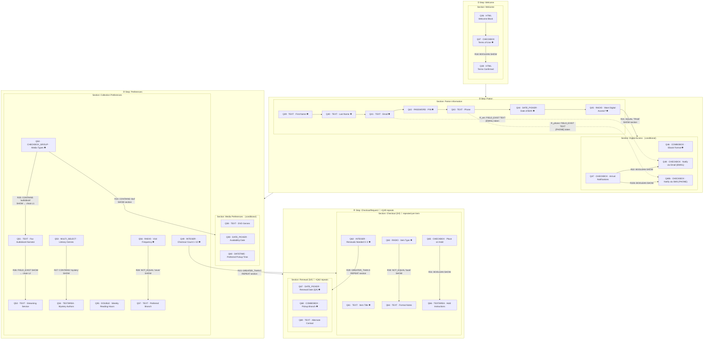

# V005 Library Card Registration Survey — Flow Diagram

## Legend

| Symbol | Meaning |
|--------|---------|
| ✱ | Required question |
| 🔁 | Repeated section (REPEAT action) |
| `〔conditional〕` | Section shown only when condition is met |
| Solid arrow `-->` | Conditional SHOW relationship |
| Dashed arrow `-.->` | TEXT token substitution (R_em / R_phone) |

## Relationship Summary

| ID | Upstream | Operator | Value | Action | Downstream |
|----|----------|----------|-------|--------|------------|
| R18 | Q37 Terms | BOOLEAN | — | SHOW | Q38 Confirmation |
| R_em | Q41 Email | FIELD_EXIST | — | TEXT `{EMAIL}` | Q48 |
| R_phone | Q43 Phone | FIELD_EXIST | — | TEXT `{PHONE}` | Q48b |
| R21 | Q45 Digital? | EQUAL | `TRUE` | SHOW section | Digital Access |
| R22 | Q47 Notifications | BOOLEAN | — | SHOW | Q48 Email notify |
| R22b | Q47 Notifications | BOOLEAN | — | SHOW | Q48b SMS notify |
| R23 | Q49 Checkout count | GREATER_THAN | `0` | REPEAT section | Checkout {S#} |
| R24 | Q50 Media types | CONTAINS | `dvd` | SHOW section | Media Preferences |
| R25 | Q50 Media types | CONTAINS | `audiobook` | SHOW | Q51 Narrator (chain L1→L2) |
| R26 | Q51 Narrator | FIELD_EXIST | — | SHOW | Q52 Streaming (chain L2→L3) |
| R27 | Q53 Genres | CONTAINS | `mystery` | SHOW | Q54 Mystery authors |
| R28 | Q56 Visit freq | NOT_EQUAL | `never` | SHOW | Q57 Preferred branch |
| R29 | Q62 Renewals | GREATER_THAN | `0` | REPEAT section | Renewal {S#} |
| R30 | Q63 Item type | NOT_EQUAL | `book` | SHOW | Q64 Format notes |
| R31 | Q65 Hold? | BOOLEAN | — | SHOW | Q66 Hold instructions |
